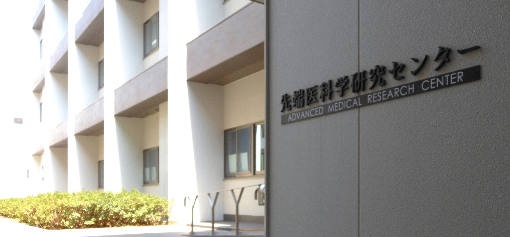

[**Yokohama City University**](https://www-user.yokohama-cu.ac.jp/~english/) (YCU) is a prominent and dynamically growing *Education & Research Institution* in Japan. 
In 2006, [**A**dvanced **M**edical **R**esearch **C**enter](https://www-user.yokohama-cu.ac.jp/~english/index.php/research/amedrc) (AMRC/SENTANKEN) 
was formed to help YCU's mission of enhancing and promoting medically-relevant research through various industry and academic collaborations.

#
**Bioinformatics Laboratory** (BI Lab) was first formed as a lab within AMRC (2009) and
it has existed in its current form since [August 2020](../members).
Our main mission is to conduct biologically-relevant [research](../research/intro) to enhance clinical and medical discoveries. 
The lab is also involved in [bioinformatics education](../teaching/intro) across Japan.  
We are always looking for motivated domestic & international researchers for [collaborating/joining](../recruitment) our lab!

Our office is located at [YCU Medical Campus](https://www.google.com/maps/place/Yokohama+City+University+School+of+Medicine/@35.34343,139.6493063,17z/data=!3m1!4b1!4m5!3m4!1s0x60184181b7f551a3:0x5df70ee57308952e!8m2!3d35.34343!4d139.651495) - easily accessible from Yokohama/Tokyo (0.5/1hr by train).

Advanced Medical Research Center (P404)
\
3–9 Fukuura, Kanazawa-ku
\
236–0004 Yokohama, Japan
<!--  Advanced Medical Research Center (SENTANKEN) ー P404 -->

横浜市立大学 先端医科学研究センター (P404)
\
〒236–0004 神奈川県
\
横浜市金沢区福浦3–9
