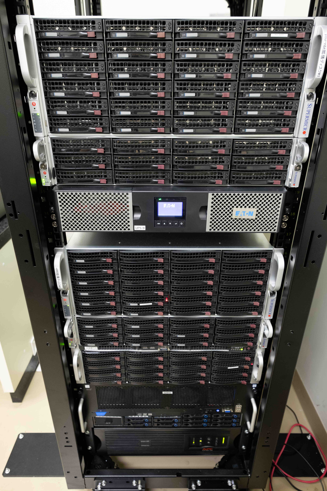
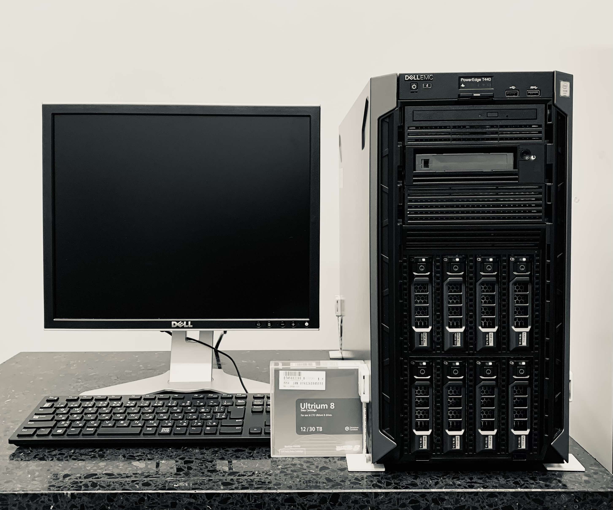

We use programming languages (*R*, *Python*, shell), computational algorithms and [nf-core pipelines](https://nf-co.re/pipelines)
to analyze a variety of NGS (*RNA-seq, Hi-C, ChIP-seq/CUTnTag/CutnRUN, ATAC-seq, single-cell data, etc.*) and clinical data.
**High-end Computational** & **LTO Tape System** servers are installed onsite to efficiently analyze and store our data. Our sequencing platform includes [10x Chromium Controler](https://www.10xgenomics.com/instruments/chromium-controller) and [NextSeq 500 sequencer](https://www.illumina.com/documents/products/appnotes/appnote-nextseq-500-wgs.pdf).      

[Nabe Takeru](https://www.nabe-intl.co.jp/largemem/largememV.html) two large-memory computational servers: **AMD EPYC 7742** 2TB RAM/128 CPU threads **(top)** & **Intel E7-8867v4** 2TB RAM/72 CPU threads **(bottom)**. Total storage: 256TB HDD.
  

[**Dell PowerEdge T440**](https://www.dell.com/ja-jp/work/shop/productdetailstxn/poweredge-t440) LTO Tape storage system allows for an efficient and long-term data storage (>20 years).
  

We are currently considering to expand one of our onsite 2TB RAM Takeru servers with two high-end GPUs. 
Additionally, GPU nodes are available as a part of the YCU 
[Cray XC50 supercomputer platform](https://insidehpc.com/2017/09/yokohama-city-university-installs-cray-xc50-ac-supercomputer-life-sciences/).